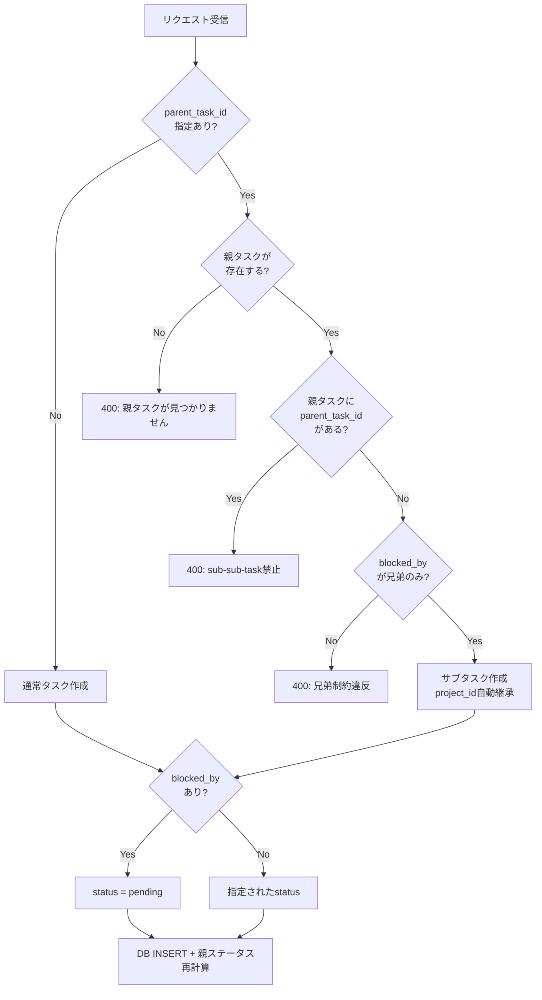

# API設計

## 1. 概要

- 全エンドポイントは `/api` 配下に配置される
- リクエスト/レスポンスは全て JSON 形式
- バリデーションは Zod スキーマによる
- 認証は Middleware で一律処理（API側での認証ロジックは不要）

## 2. Projects API

### GET /api/projects

プロジェクト一覧を取得する。

**レスポンス**: `200 OK`

```json
[
  {
    "id": "a1b2c3d4e5f6g7h8",
    "title": "プロジェクトA",
    "status": "processing",
    "condition": "全タスクが完了していること",
    "created_at": "2026-03-12 10:00:00",
    "updated_at": "2026-03-12 10:00:00",
    "task_count": 5,
    "done_count": 2
  }
]
```

- `task_count`: 親レベルタスクの総数（サブタスクは含まない）
- `done_count`: status が done のタスク数

---

### POST /api/projects

プロジェクトを作成する。

**リクエストボディ**:

| フィールド | 型 | 必須 | 説明 |
|---|---|---|---|
| title | string | ○ | プロジェクト名（1文字以上） |
| status | string | - | yet / processing / finished（デフォルト: yet） |
| condition | string | - | 完了条件 |
| id | string | - | クライアント生成ID（楽観的更新用） |

**レスポンス**: `201 Created`

```json
{
  "id": "a1b2c3d4e5f6g7h8",
  "title": "プロジェクトA",
  "status": "yet",
  "condition": "",
  "created_at": "2026-03-12 10:00:00",
  "updated_at": "2026-03-12 10:00:00"
}
```

**エラー**: `400 Bad Request`（バリデーション失敗）

---

### GET /api/projects/:id

プロジェクト詳細とそのタスク一覧を取得する。

**レスポンス**: `200 OK`

```json
{
  "id": "a1b2c3d4e5f6g7h8",
  "title": "プロジェクトA",
  "status": "processing",
  "condition": "...",
  "tasks": [
    { "id": "...", "title": "...", "status": "doing", ... }
  ]
}
```

**エラー**: `404 Not Found`

---

### PATCH /api/projects/:id

プロジェクトを更新する。

**リクエストボディ**: 変更するフィールドのみ指定。

| フィールド | 型 | 説明 |
|---|---|---|
| title | string | プロジェクト名 |
| status | string | ステータス |
| condition | string | 完了条件 |

**レスポンス**: `200 OK`（更新後のプロジェクト）

---

### DELETE /api/projects/:id

プロジェクトを削除する。紐づくタスクの `project_id` は NULL に設定される（Standalone化）。

**レスポンス**: `200 OK`

```json
{ "success": true }
```

---

## 3. Tasks API

### GET /api/tasks

タスク一覧を取得する。クエリパラメータでフィルタリング可能。

**クエリパラメータ**:

| パラメータ | 型 | 説明 |
|---|---|---|
| parent_task_id | string | `null` で親レベルのみ、IDでサブタスクのみ |
| project_id | string | `null` でStandaloneのみ、IDでプロジェクト指定 |
| status | string | カンマ区切り（例: `yet,doing,pending`） |
| priority | string | カンマ区切り（例: `must,should`） |

**ソート順**:
1. 優先度: must → should → want
2. ステータス: doing → yet → pending → done → canceled
3. 期日: 昇順（NULLは最後）
4. 作成日: 降順

**レスポンス**: `200 OK`

```json
[
  {
    "id": "t1",
    "title": "タスク1",
    "condition": "完了条件",
    "due_date": "2026-03-20",
    "priority": "must",
    "status": "doing",
    "project_id": "p1",
    "parent_task_id": null,
    "project_title": "プロジェクトA",
    "blocked_by": [],
    "sub_tasks": [
      {
        "id": "st1",
        "title": "サブタスク1",
        "status": "yet",
        "blocked_by": ["st2"],
        "sub_tasks": [],
        ...
      }
    ],
    ...
  }
]
```

---

### POST /api/tasks

タスクまたはサブタスクを作成する。

**リクエストボディ**:

| フィールド | 型 | 必須 | 説明 |
|---|---|---|---|
| title | string | ○ | タスク名（1文字以上） |
| condition | string | - | 完了条件 |
| due_date | string\|null | - | 期日（ISO日付） |
| priority | string | - | must / should / want（デフォルト: should） |
| status | string | - | ステータス（デフォルト: yet） |
| project_id | string\|null | - | プロジェクトID |
| parent_task_id | string\|null | - | 親タスクID（サブタスク作成時） |
| blocked_by | string[] | - | ブロッカータスクID配列 |
| id | string | - | クライアント生成ID |

**バリデーションルール**:



**レスポンス**: `201 Created`

**エラー**: `400 Bad Request`

---

### GET /api/tasks/:id

タスク詳細を取得する（サブタスク・依存関係含む）。

**レスポンス**: `200 OK`（上記一覧の1要素と同形式）

---

### PATCH /api/tasks/:id

タスクを更新する。

**リクエストボディ**: 変更するフィールドのみ指定。

**制約**:

| 制約 | エラー |
|---|---|
| サブタスクが存在するタスクの status 変更 | 400: ステータスは自動計算されます |
| サブタスクの project_id 変更 | 400: 親タスクに従います |
| blocked_by に存在しないタスクID | 400: ブロッカータスクが見つかりません |
| サブタスクの blocked_by に非兄弟タスク | 400: 兄弟制約違反 |

**副作用**:
- ステータス変更時: 親タスクのステータスを再計算
- ステータス変更時: このタスクをブロッカーとしているタスクのステータスを再計算
- blocked_by 変更時: pending/yet の自動遷移

---

### DELETE /api/tasks/:id

タスクを削除する。

- サブタスクは CASCADE で自動削除
- 依存関係レコードも削除
- 親タスクのステータスを再計算

**レスポンス**: `200 OK`

```json
{ "success": true }
```

## 4. エラーレスポンス形式

```json
{
  "error": "エラーメッセージ（日本語）"
}
```

バリデーションエラーの場合:

```json
{
  "error": [
    { "message": "タイトルは必須です", "path": ["title"] }
  ]
}
```
