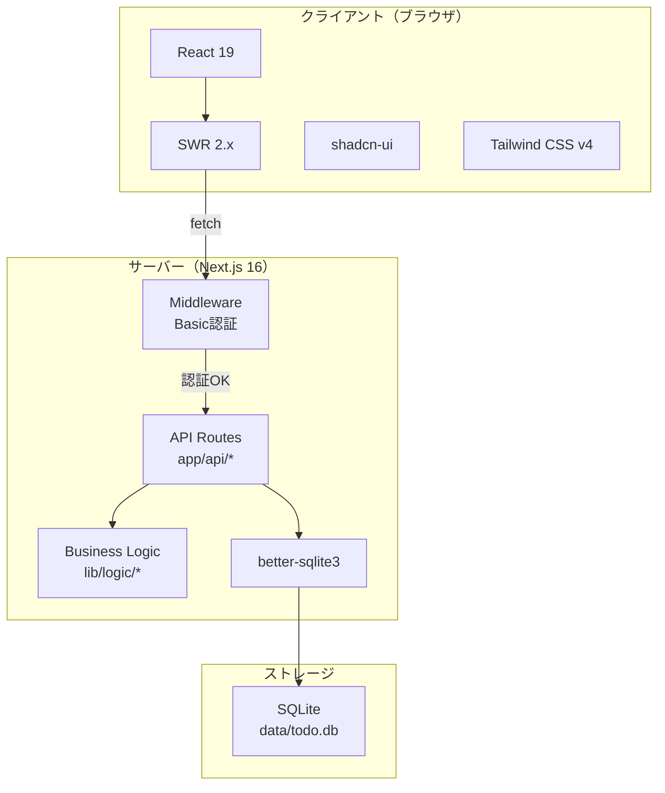
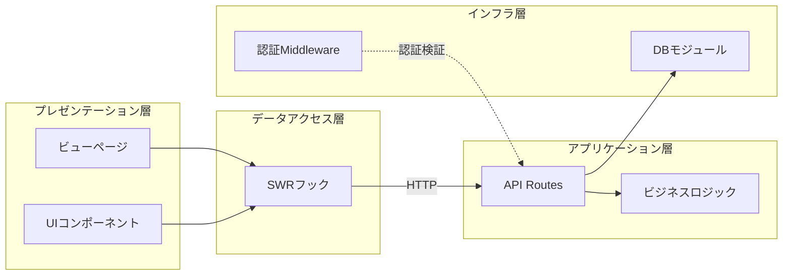
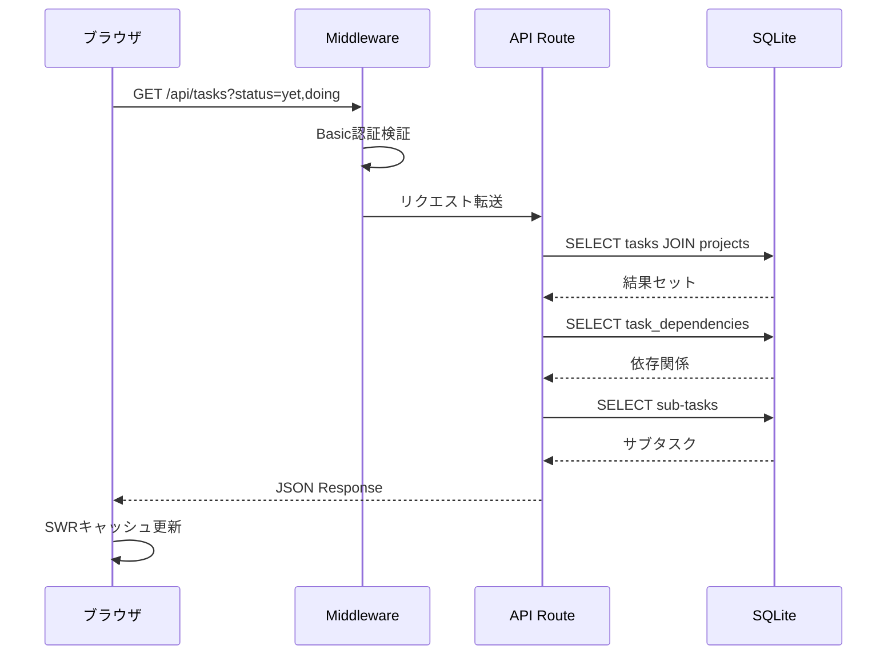
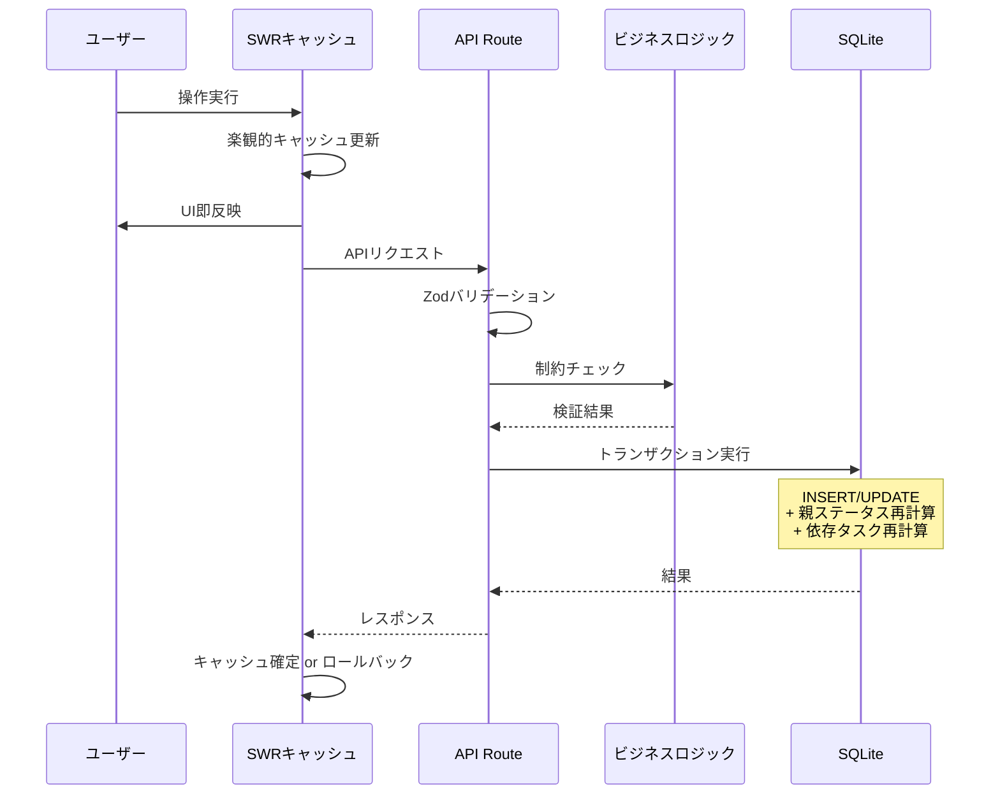

# システムアーキテクチャ

## 1. 技術スタック

## 2. レイヤー構成

本アプリケーションは以下の4層で構成される。

### 各レイヤーの責務

| レイヤー | 責務 | 主要ファイル |
|---|---|---|
| プレゼンテーション | UI表示・ユーザーインタラクション | `app/(views)/*`, `components/*` |
| データアクセス | API通信・キャッシュ管理・楽観的更新 | `hooks/*` |
| アプリケーション | HTTPリクエスト処理・バリデーション・ビジネスルール適用 | `app/api/*`, `lib/logic/*` |
| インフラ | DB接続・マイグレーション・認証 | `lib/db.ts`, `middleware.ts` |

## 3. リクエスト処理フロー

### 3.1 読み取りフロー（GET）

### 3.2 書き込みフロー（POST/PATCH/DELETE）

## 4. 主要な設計判断

### 4.1 IDの生成方式

- **16文字のランダムhex文字列**を採用
- 理由: クライアント側でもサーバー側でも同一ロジックで生成可能
- 利点: 楽観的更新時にクライアントがIDを事前生成できるため、作成後即座にUIに反映できる

### 4.2 SWRの選定理由

| 候補 | 判断 | 理由 |
|---|---|---|
| SWR | **採用** | 軽量、Next.jsとの親和性、`mutate`の楽観的更新で十分 |
| React Query | 不採用 | 個人ツールにはオーバースペック |
| Server Components | 不採用 | フィルタリング・楽観的更新がインタラクティブなためClient Componentが適切 |

### 4.3 SQLiteの選定理由

- 外部サービス不要（ローカル完結）
- better-sqlite3による同期APIでトランザクション制御が容易
- 個人利用のためスケーラビリティは不要
- WALモードで読み取り性能を確保

### 4.4 ビューページのClient Component化

- 全3ビューがインタラクティブなフィルタリングと楽観的更新を必要とする
- Server ComponentではSWRのリアクティブなキャッシュ管理が使えない
- ページ自体は `'use client'` ディレクティブを持つClient Componentとして実装
