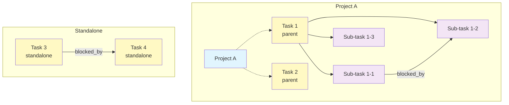

# データベース設計

## 1. ER図

```mermaid
erDiagram
    projects ||--o{ tasks : "has"
    tasks ||--o{ tasks : "parent_task_id"
    tasks ||--o{ task_dependencies : "task_id"
    tasks ||--o{ task_dependencies : "blocked_by_task_id"

    projects {
        TEXT id PK "16文字hex"
        TEXT title "NOT NULL"
        TEXT status "yet|processing|finished"
        TEXT condition "デフォルト空文字"
        TEXT created_at "datetime"
        TEXT updated_at "datetime"
    }

    tasks {
        TEXT id PK "16文字hex"
        TEXT title "NOT NULL"
        TEXT condition "デフォルト空文字"
        TEXT due_date "NULLable ISO日付"
        TEXT priority "must|should|want"
        TEXT status "canceled|yet|doing|pending|done"
        TEXT project_id FK "NULLable → projects.id"
        TEXT parent_task_id FK "NULLable → tasks.id"
        TEXT created_at "datetime"
        TEXT updated_at "datetime"
    }

    task_dependencies {
        TEXT task_id PK_FK "→ tasks.id"
        TEXT blocked_by_task_id PK_FK "→ tasks.id"
    }
```

## 2. テーブル定義

### 2.1 projects テーブル

プロジェクト情報を管理する。

| カラム | 型 | 制約 | デフォルト | 説明 |
|---|---|---|---|---|
| id | TEXT | PRIMARY KEY | - | 16文字ランダムhex |
| title | TEXT | NOT NULL | - | プロジェクト名 |
| status | TEXT | NOT NULL, CHECK | 'yet' | yet / processing / finished |
| condition | TEXT | NOT NULL | '' | 完了条件 |
| created_at | TEXT | NOT NULL | datetime('now') | 作成日時 |
| updated_at | TEXT | NOT NULL | datetime('now') | 更新日時 |

### 2.2 tasks テーブル

タスクおよびサブタスクの情報を管理する。同一テーブルで `parent_task_id` の有無により区別する。

| カラム | 型 | 制約 | デフォルト | 説明 |
|---|---|---|---|---|
| id | TEXT | PRIMARY KEY | - | 16文字ランダムhex |
| title | TEXT | NOT NULL | - | タスク名 |
| condition | TEXT | NOT NULL | '' | 完了条件 |
| due_date | TEXT | - | NULL | 期日（ISO日付文字列） |
| priority | TEXT | NOT NULL, CHECK | 'should' | must / should / want |
| status | TEXT | NOT NULL, CHECK | 'yet' | canceled / yet / doing / pending / done |
| project_id | TEXT | FK → projects(id) | NULL | 所属プロジェクト |
| parent_task_id | TEXT | FK → tasks(id) | NULL | 親タスク（サブタスクの場合） |
| created_at | TEXT | NOT NULL | datetime('now') | 作成日時 |
| updated_at | TEXT | NOT NULL | datetime('now') | 更新日時 |

**外部キー動作:**
- `project_id`: ON DELETE SET NULL（プロジェクト削除時にStandalone化）
- `parent_task_id`: ON DELETE CASCADE（親タスク削除時にサブタスクも削除）

### 2.3 task_dependencies テーブル

タスク間のブロック関係（依存関係）を管理するジャンクションテーブル。

| カラム | 型 | 制約 | 説明 |
|---|---|---|---|
| task_id | TEXT | NOT NULL, FK → tasks(id) | ブロックされるタスク |
| blocked_by_task_id | TEXT | NOT NULL, FK → tasks(id) | ブロックするタスク（先行タスク） |

- **複合主キー**: (task_id, blocked_by_task_id)
- **外部キー動作**: 両方とも ON DELETE CASCADE

### 設計判断: JSON vs ジャンクションテーブル

`blocked_by` を tasks テーブル内のJSON配列として格納する方式も検討したが、以下の理由でジャンクションテーブルを採用した。

| 観点 | JSON方式 | ジャンクションテーブル方式 |
|---|---|---|
| 参照整合性 | 保証不可 | FK制約で保証 |
| カスケード削除 | 手動実装が必要 | ON DELETE CASCADE で自動 |
| 兄弟制約の検証 | JOINが複雑 | SQLで直接検索可能 |
| クエリ性能 | JSONパース必要 | インデックス利用可能 |

## 3. インデックス

| インデックス名 | カラム | 用途 |
|---|---|---|
| idx_tasks_project_id | tasks.project_id | プロジェクト別タスク取得 |
| idx_tasks_parent_task_id | tasks.parent_task_id | サブタスク取得・親タスク再計算 |
| idx_tasks_status | tasks.status | ステータスフィルタ |
| idx_tasks_priority | tasks.priority | 優先度フィルタ |

## 4. データの関係図



## 5. マイグレーション戦略

- `CREATE TABLE IF NOT EXISTS` / `CREATE INDEX IF NOT EXISTS` による冪等なマイグレーション
- アプリケーション起動時（`getDb()` 初回呼び出し時）に自動実行
- 個人利用のためバージョン管理は行わない（スキーマ変更時はDB再作成）
