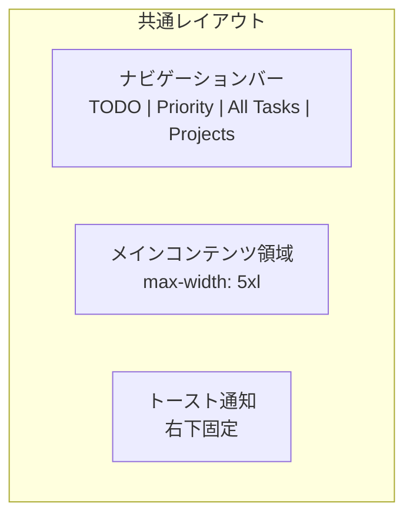
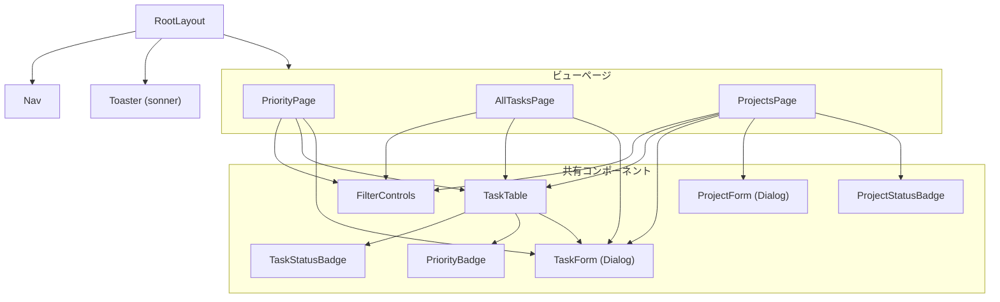
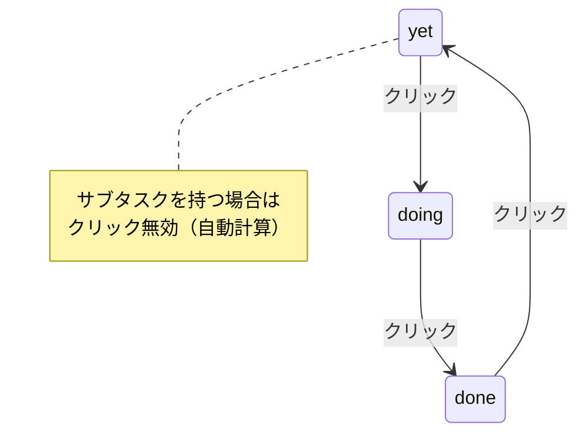

# 画面設計

## 1. 画面一覧

| 画面名 | パス | 説明 |
|---|---|---|
| ルート | `/` | `/priority` へリダイレクト |
| Priority View | `/priority` | 優先度別グループ表示 |
| All Tasks | `/tasks` | 全タスクリスト表示 |
| Projects | `/projects` | プロジェクト別グループ表示 |

## 2. 画面レイアウト



### 共通レイアウト構成

```
┌──────────────────────────────────────┐
│ TODO   [Priority] [All Tasks] [Projects] │  ← Nav（sticky）
├──────────────────────────────────────┤
│                                          │
│  ページタイトル         [フィルタ] [+ボタン] │
│                                          │
│  ┌────────────────────────────────┐  │
│  │ タスクテーブル / セクション         │  │
│  │                                    │  │
│  └────────────────────────────────┘  │
│                                          │
└──────────────────────────────────────┘
                                    ┌─────┐
                                    │Toast│ ← 右下
                                    └─────┘
```

## 3. 各画面の詳細

### 3.1 Priority View (`/priority`)

```
┌──────────────────────────────────────┐
│ Priority View    [yet][doing][pending] [+ Task] │
├──────────────────────────────────────┤
│                                          │
│ Must (3)                                 │
│ ┌──────────────────────────────────┐ │
│ │ Status │ Title          │ Proj │ Due │ │
│ │ [Doing]│ タスクA         │ ProjA│ 3/20│ │
│ │ [Yet]  │ ▶ タスクB      │ -    │ -   │ │
│ │ [Pend] │ タスクC         │ ProjB│ 3/25│ │
│ └──────────────────────────────────┘ │
│                                          │
│ Should (2)                               │
│ ┌──────────────────────────────────┐ │
│ │ ...                                  │ │
│ └──────────────────────────────────┘ │
│                                          │
│ Want (1)                                 │
│ ┌──────────────────────────────────┐ │
│ │ ...                                  │ │
│ └──────────────────────────────────┘ │
└──────────────────────────────────────┘
```

- Priority列は非表示（グループで判別可能）
- 各グループにタスク数を表示

### 3.2 All Tasks (`/tasks`)

```
┌──────────────────────────────────────┐
│ All Tasks        [yet][doing][pending] [+ Task] │
├──────────────────────────────────────┤
│ ┌──────────────────────────────────┐ │
│ │ Status │ Priority │ Title  │ Proj │ Due │ │
│ │ [Doing]│ [Must]   │ タスクA │ ProjA│ 3/20│ │
│ │ [Yet]  │ [Should] │ タスクD │ -    │ -   │ │
│ │ [Pend] │ [Want]   │ タスクE │ ProjB│ 4/01│ │
│ └──────────────────────────────────┘ │
└──────────────────────────────────────┘
```

- 全カラム表示
- モバイルではProject列・Due列を非表示

### 3.3 Projects (`/projects`)

```
┌──────────────────────────────────────┐
│ Projects        [yet][doing][pending] [+ Project]│
├──────────────────────────────────────┤
│ ┌ Project A [Processing] 2/5 ─ [+ Task] [...] ┐│
│ │ Goal: 全機能の実装完了                         ││
│ │ ┌────────────────────────────────┐ ││
│ │ │ Status │ Priority │ Title     │ Due  │ ││
│ │ │ [Doing]│ [Must]   │ ▶ タスク1 │ 3/20 │ ││
│ │ │ [Yet]  │ [Should] │ タスク2   │ -    │ ││
│ │ └────────────────────────────────┘ ││
│ └──────────────────────────────────────┘│
│                                          │
│ ┌ No Project ─────────── [+ Task] ─────┐│
│ │ ┌────────────────────────────────┐ ││
│ │ │ Status │ Priority │ Title     │ Due  │ ││
│ │ │ [Yet]  │ [Want]   │ 雑務      │ -    │ ││
│ │ └────────────────────────────────┘ ││
│ └──────────────────────────────────────┘│
└──────────────────────────────────────┘
```

- プロジェクトごとにカードセクション
- Project列は非表示（セクションで判別可能）
- 「No Project」セクションは破線ボーダー

## 4. コンポーネント構成



## 5. インタラクション設計

### 5.1 ステータスバッジクリック



### 5.2 タスク行メニュー

| メニュー項目 | 条件 | 動作 |
|---|---|---|
| Edit | 常時 | タスク編集ダイアログを開く |
| Add Sub-task | 親タスクのみ | サブタスク追加ダイアログを開く |
| Delete | 常時 | タスクを削除（サブタスクもカスケード） |

### 5.3 サブタスク展開

- 親タスクにサブタスクが存在する場合、タイトル左に ▶ を表示
- クリックで ▼ に切り替わり、サブタスク行を展開表示
- サブタスク行はインデント + 背景色の違いで視覚的に区別

### 5.4 フィルタコントロール

- 5つのステータスボタンがトグル形式で並ぶ
- アクティブなステータスは Primary カラーで強調
- 非アクティブはボーダーのみの表示
- デフォルト: yet / doing / pending がアクティブ

## 6. レスポンシブ対応

| 要素 | デスクトップ (sm以上) | モバイル (sm未満) |
|---|---|---|
| Project列 | 表示 | 非表示 (`hidden sm:table-cell`) |
| Due列 | 表示 | 非表示 (`hidden sm:table-cell`) |
| フィルタ + 作成ボタン | 横並び | 折り返し (`flex-wrap`) |
| ダイアログ | 幅400px | フル幅 - 2rem |
| ナビゲーション | 横並び | 横並び（コンパクト） |
