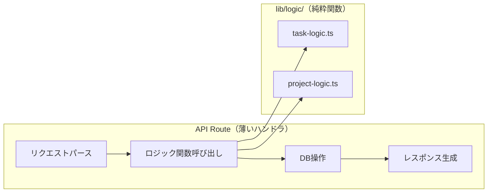
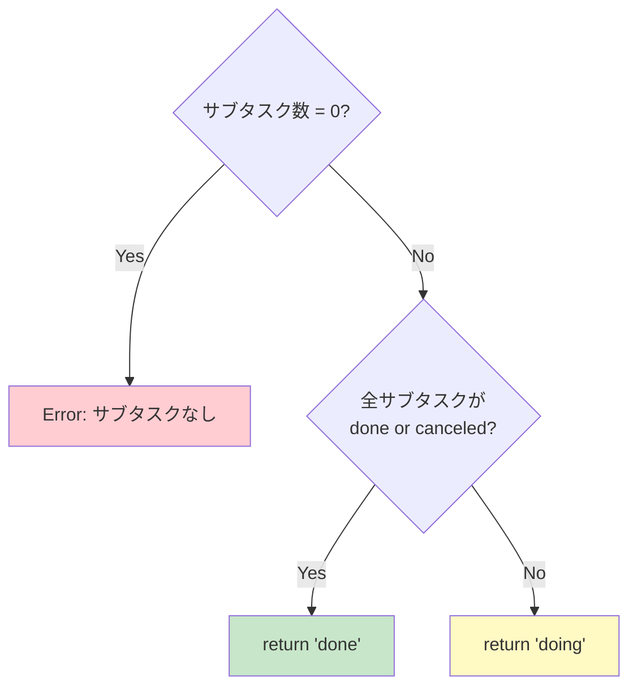
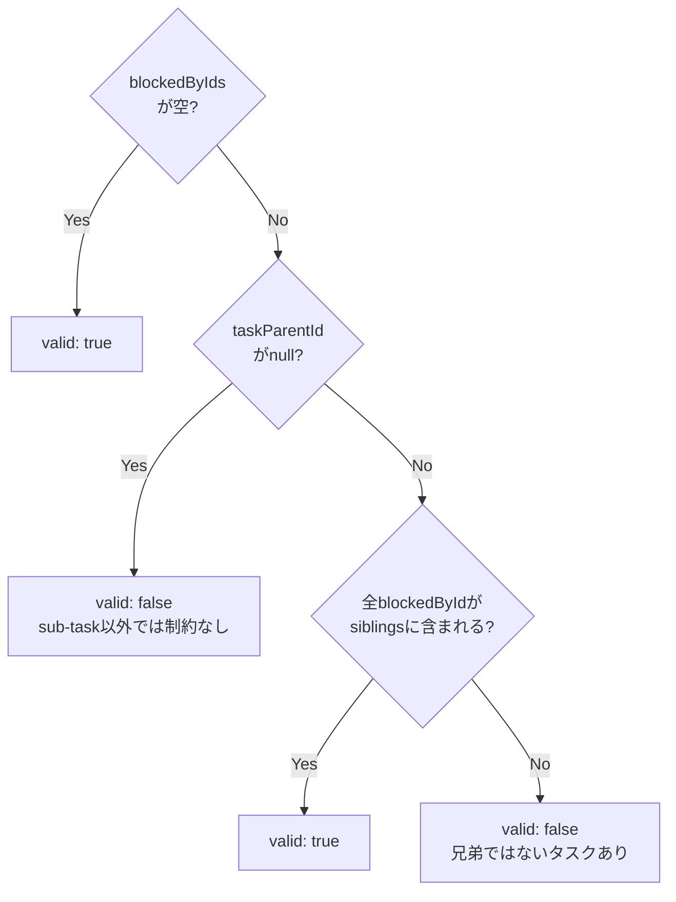
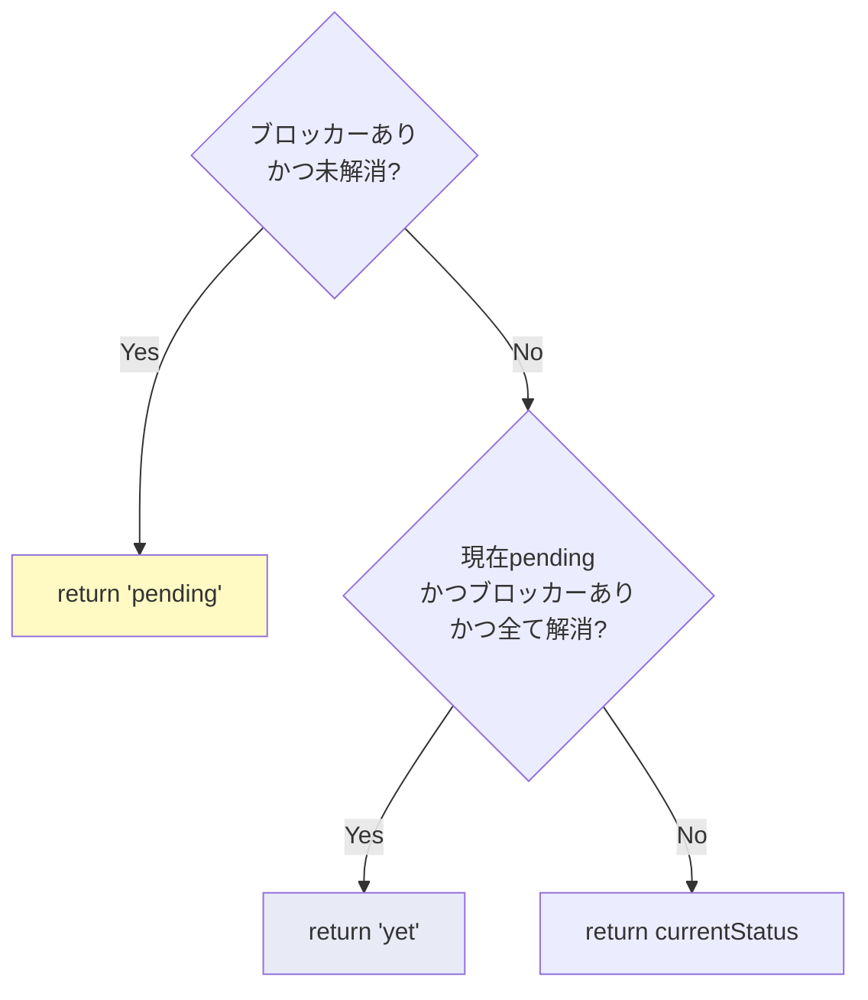
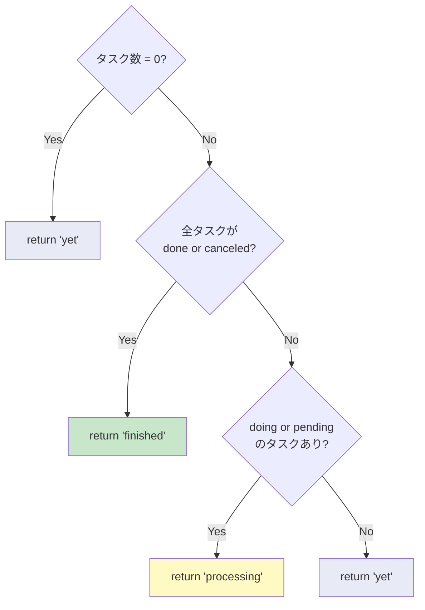
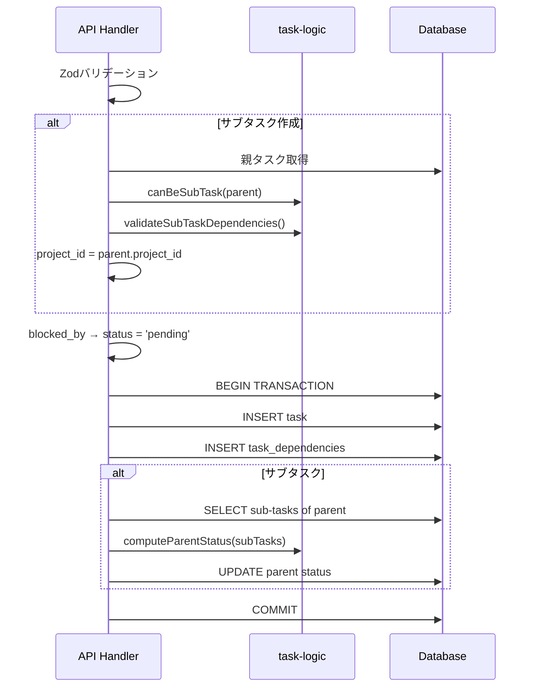
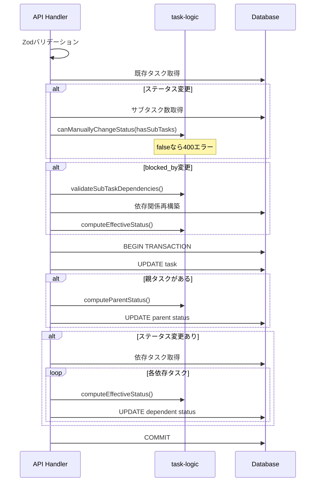

# ビジネスロジック詳細設計

## 1. 設計原則

ビジネスロジックは**純粋関数**として `lib/logic/` に切り出す。

- 副作用なし（DB/ネットワーク/グローバル状態への依存なし）
- 入力に対して常に同じ出力を返す
- 単体テストが容易



## 2. task-logic.ts

### 2.1 computeParentStatus

サブタスクの状態から親タスクのステータスを計算する。

```typescript
function computeParentStatus(
  subTasks: { status: TaskStatus }[]
): TaskStatus
```

**アルゴリズム**:



**入出力例**:

| サブタスクの状態 | 結果 |
|---|---|
| `[done, done]` | done |
| `[done, canceled]` | done |
| `[canceled, canceled]` | done |
| `[doing, done]` | doing |
| `[yet, done]` | doing |
| `[pending, done]` | doing |
| `[]` | Error |

### 2.2 shouldBePending

ブロッカーの状態からタスクが pending であるべきかを判定する。

```typescript
function shouldBePending(
  blockerStatuses: TaskStatus[]
): boolean
```

**ルール**: ブロッカーが1つでも done/canceled 以外であれば true

| ブロッカーの状態 | 結果 |
|---|---|
| `[]` | false |
| `[done, done]` | false |
| `[done, canceled]` | false |
| `[yet, done]` | true |
| `[doing]` | true |
| `[pending]` | true |

### 2.3 validateSubTaskDependencies

サブタスクの `blocked_by` が同じ親の兄弟サブタスクのみを参照しているかを検証する。

```typescript
function validateSubTaskDependencies(
  taskParentId: string | null,
  blockedByIds: string[],
  siblingTasks: { id: string; parent_task_id: string | null }[]
): { valid: boolean; error?: string }
```

**検証フロー**:



### 2.4 canBeSubTask

親タスク候補がサブタスクでないこと（＝サブサブタスク禁止）を確認する。

```typescript
function canBeSubTask(
  parentTask: { parent_task_id: string | null }
): boolean
```

- `parent_task_id === null` → true（親になれる）
- `parent_task_id !== null` → false（既にサブタスクなので親になれない）

### 2.5 canManuallyChangeStatus

サブタスクが存在する場合、親タスクのステータスを手動変更できないことを判定する。

```typescript
function canManuallyChangeStatus(
  hasSubTasks: boolean
): boolean
```

- `hasSubTasks = false` → true（手動変更可能）
- `hasSubTasks = true` → false（自動計算のため手動変更不可）

### 2.6 computeEffectiveStatus

現在のステータスとブロッカーの状態から実効ステータスを計算する。

```typescript
function computeEffectiveStatus(
  currentStatus: TaskStatus,
  blockerStatuses: TaskStatus[]
): TaskStatus
```

**アルゴリズム**:



## 3. project-logic.ts

### 3.1 suggestProjectStatus

プロジェクトに属するタスクの状態から、プロジェクトの推奨ステータスを導出する。

```typescript
function suggestProjectStatus(
  tasks: { status: TaskStatus }[]
): ProjectStatus
```

**アルゴリズム**:



## 4. API Routeでのロジック適用

API RouteはCRUD操作の中でこれらの純粋関数を呼び出し、副作用（DB更新）と組み合わせる。

### 4.1 タスク作成時のフロー



### 4.2 タスク更新時のフロー



## 5. トランザクション管理

以下の操作はトランザクション内で実行し、データ整合性を保証する。

| 操作 | トランザクション内の処理 |
|---|---|
| タスク作成 | INSERT task + INSERT dependencies + UPDATE parent status |
| タスク更新 | UPDATE task + UPDATE parent status + UPDATE dependent statuses |
| タスク削除 | DELETE dependencies + DELETE task + UPDATE parent status |
