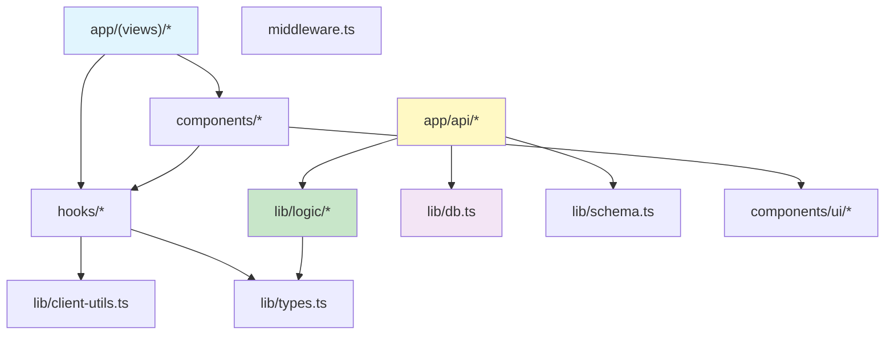

# ディレクトリ構成

## 1. 全体構成

```
my_todo_app/
├── app/                          # Next.js App Router
│   ├── layout.tsx                # ルートレイアウト（Nav + Toaster）
│   ├── page.tsx                  # / → /priority リダイレクト
│   ├── globals.css               # グローバルCSS（shadcn-ui テーマ変数）
│   ├── favicon.ico
│   ├── api/                      # API Routes（バックエンド）
│   │   ├── projects/
│   │   │   ├── route.ts          # GET /api/projects, POST /api/projects
│   │   │   └── [id]/
│   │   │       └── route.ts      # GET/PATCH/DELETE /api/projects/:id
│   │   ├── tasks/
│   │   │   ├── route.ts          # GET /api/tasks, POST /api/tasks
│   │   │   └── [id]/
│   │   │       └── route.ts      # GET/PATCH/DELETE /api/tasks/:id
│   │   └── __tests__/
│   │       └── api.test.ts       # API統合テスト
│   └── (views)/                  # ルートグループ（URLに影響しない）
│       ├── priority/
│       │   └── page.tsx          # /priority - 優先度別ビュー
│       ├── tasks/
│       │   └── page.tsx          # /tasks - 全タスクビュー
│       └── projects/
│           └── page.tsx          # /projects - プロジェクト別ビュー
│
├── components/                   # UIコンポーネント
│   ├── ui/                       # shadcn-ui 基盤コンポーネント（自動生成）
│   │   ├── button.tsx
│   │   ├── dialog.tsx
│   │   ├── dropdown-menu.tsx
│   │   ├── input.tsx
│   │   ├── select.tsx
│   │   ├── table.tsx
│   │   ├── badge.tsx
│   │   ├── label.tsx
│   │   ├── textarea.tsx
│   │   ├── popover.tsx
│   │   ├── checkbox.tsx
│   │   ├── separator.tsx
│   │   ├── scroll-area.tsx
│   │   ├── tabs.tsx
│   │   └── sheet.tsx
│   ├── nav.tsx                   # ナビゲーションバー
│   ├── task-table.tsx            # タスクテーブル（メイン表示コンポーネント）
│   ├── task-form.tsx             # タスク作成/編集ダイアログ
│   ├── project-form.tsx          # プロジェクト作成/編集ダイアログ
│   ├── status-badge.tsx          # ステータスバッジ（Task/Project）
│   ├── priority-badge.tsx        # 優先度バッジ
│   └── filter-controls.tsx       # ステータスフィルタトグル
│
├── hooks/                        # カスタムフック
│   ├── use-tasks.ts              # タスクCRUD + SWR楽観的更新
│   ├── use-projects.ts           # プロジェクトCRUD + SWR楽観的更新
│   └── use-status-filter.ts      # ステータスフィルタ状態管理
│
├── lib/                          # 共有ライブラリ
│   ├── db.ts                     # SQLiteシングルトン + マイグレーション
│   ├── types.ts                  # TypeScript型定義
│   ├── schema.ts                 # Zodバリデーションスキーマ
│   ├── utils.ts                  # cn() ユーティリティ（shadcn-ui）
│   ├── client-utils.ts           # クライアント用ヘルパー（ID生成, fetcher）
│   └── logic/                    # ビジネスロジック（純粋関数）
│       ├── task-logic.ts         # タスクステータス計算・バリデーション
│       ├── project-logic.ts      # プロジェクトステータス推定
│       └── __tests__/            # ロジック単体テスト
│           ├── task-logic.test.ts
│           └── project-logic.test.ts
│
├── docs/                         # ドキュメント
│   ├── README.md                 # 目次
│   ├── requirements/             # 要件定義
│   ├── basic-design/             # 基本設計
│   └── detailed-design/          # 詳細設計
│
├── data/                         # データベースファイル（gitignore対象）
│   └── todo.db                   # SQLiteデータベース
│
├── middleware.ts                  # Basic認証ミドルウェア
├── .env.local                    # 環境変数（認証情報、DBパス）
├── package.json                  # 依存関係・スクリプト
├── pnpm-lock.yaml                # pnpmロックファイル
├── tsconfig.json                 # TypeScript設定
├── vitest.config.ts              # Vitestテスト設定
├── components.json               # shadcn-ui設定
├── next.config.ts                # Next.js設定
├── postcss.config.mjs            # PostCSS設定
├── eslint.config.mjs             # ESLint設定
└── .gitignore
```

## 2. ディレクトリの役割

### app/

Next.js App Routerのルーティング構造。ページとAPIルートを含む。

- `(views)/` はルートグループで、URLパスには影響しない。`/priority`, `/tasks`, `/projects` として公開される
- `api/` 配下がバックエンドのRESTエンドポイント

### components/

再利用可能なUIコンポーネント群。

- `ui/`: shadcn-ui CLIで生成された基盤コンポーネント。手動編集しない
- それ以外: アプリケーション固有のコンポーネント

### hooks/

React Hooksをカスタムフックとして切り出したもの。データアクセス層に相当する。

### lib/

フレームワーク非依存の共有コード。

- `logic/`: ビジネスロジック（純粋関数）。テスト容易性のためにここに分離
- `db.ts`: サーバーサイドのみで使用
- `client-utils.ts`: クライアントサイドのみで使用
- `types.ts`, `schema.ts`: 両方で使用

## 3. 依存関係の方向



**原則**:
- クライアントコード（Pages, Components, Hooks）はサーバーコード（API, DB）を直接importしない
- API RouteはHooksを使わない
- Logic層はDB層に依存しない（純粋関数）
- UI基盤コンポーネント（`components/ui/`）はアプリケーションコンポーネントに依存しない

## 4. 命名規則

| 対象 | 規則 | 例 |
|---|---|---|
| ファイル名 | kebab-case | `task-form.tsx`, `use-tasks.ts` |
| コンポーネント | PascalCase | `TaskTable`, `FilterControls` |
| フック | camelCase (use prefix) | `useTasks`, `useStatusFilter` |
| 型 | PascalCase | `TaskWithRelations`, `ProjectStatus` |
| 定数 | UPPER_SNAKE_CASE | `TASK_STATUSES`, `TASK_PRIORITIES` |
| API関数 | UPPER_CASE (HTTP method) | `GET`, `POST`, `PATCH`, `DELETE` |
| ロジック関数 | camelCase | `computeParentStatus`, `shouldBePending` |

## 5. 環境変数

| 変数名 | デフォルト | 説明 |
|---|---|---|
| BASIC_AUTH_USER | admin | Basic認証ユーザー名 |
| BASIC_AUTH_PASS | password | Basic認証パスワード |
| DATABASE_PATH | ./data/todo.db | SQLiteデータベースファイルパス |
