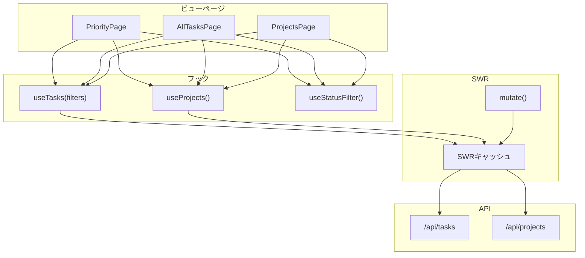
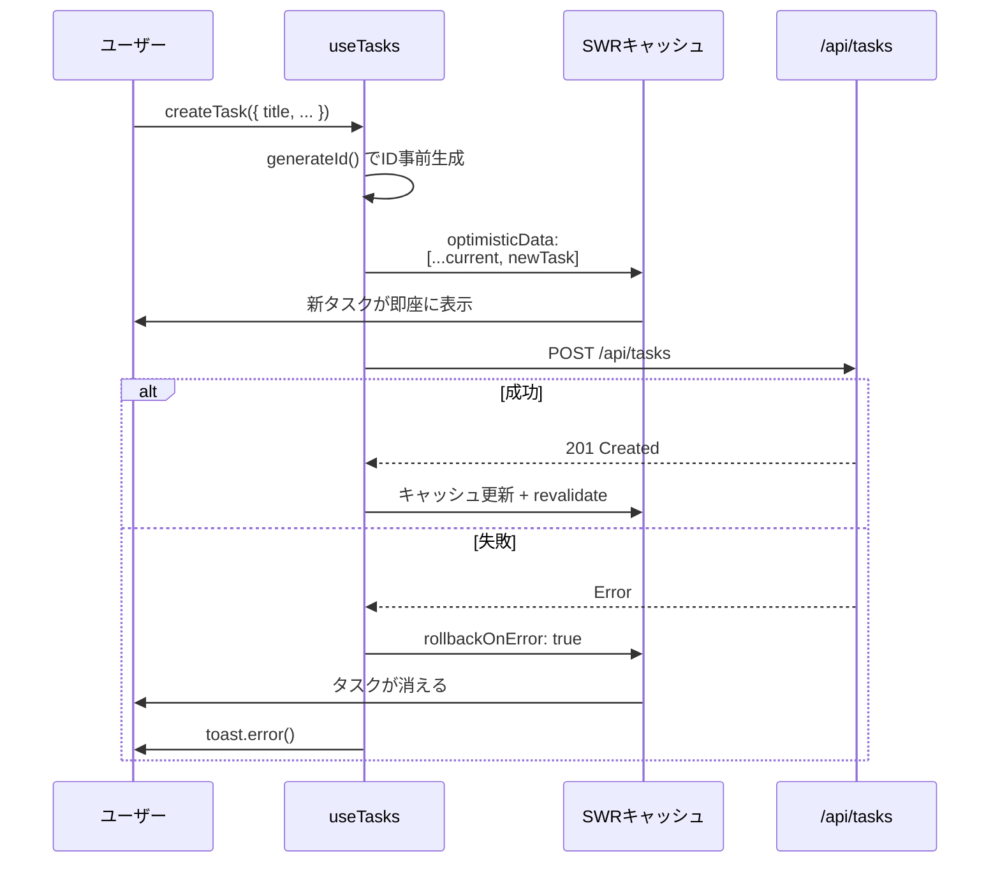
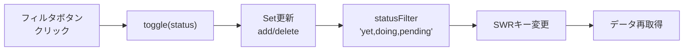
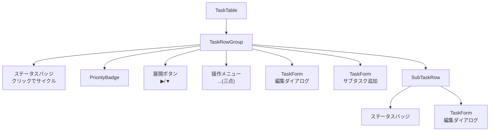
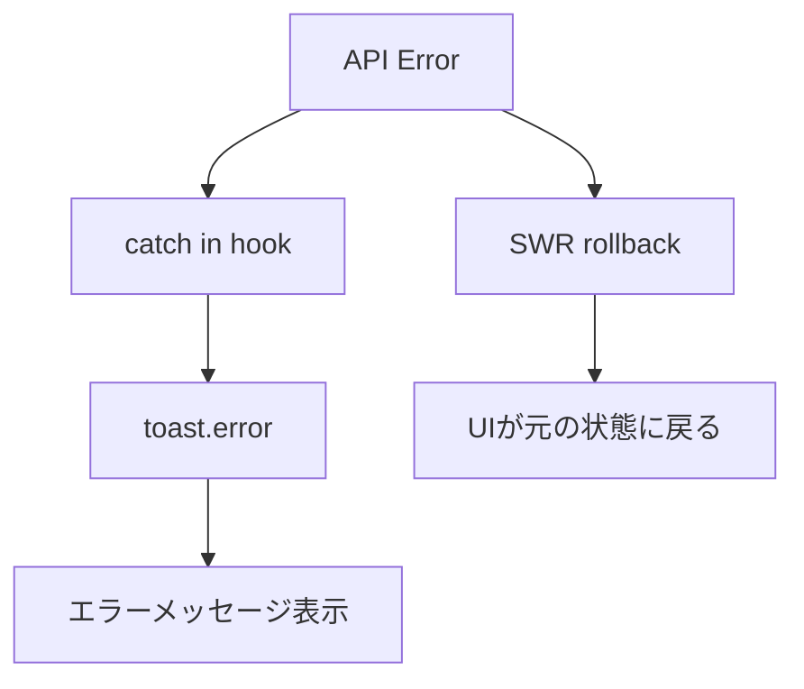

# フロントエンド詳細設計

## 1. データフェッチング戦略

### 1.1 SWRフック構成



### 1.2 useTasks フック

```typescript
function useTasks(filters: TaskFilters): {
  tasks: TaskWithRelations[];
  error: Error | undefined;
  isLoading: boolean;
  mutate: KeyedMutator;
  createTask: (data) => Promise<void>;
  updateTask: (id, patch) => Promise<void>;
  deleteTask: (id) => Promise<void>;
}
```

**キャッシュキー生成**: フィルタからURLを構築し、フィルタごとに独立したキャッシュを持つ。

```
/api/tasks?parent_task_id=null&status=yet,doing,pending
```

### 1.3 useProjects フック

```typescript
function useProjects(): {
  projects: ProjectWithCounts[];
  error: Error | undefined;
  isLoading: boolean;
  mutate: KeyedMutator;
  createProject: (data) => Promise<void>;
  updateProject: (id, patch) => Promise<void>;
  deleteProject: (id) => Promise<void>;
}
```

**キャッシュキー**: `/api/projects`（固定、フィルタなし）

## 2. 楽観的更新の実装

### 2.1 作成操作



### 2.2 更新操作

```typescript
await mutate(
  async (current) => {
    const res = await fetch(`/api/tasks/${id}`, { method: 'PATCH', body });
    if (!res.ok) throw new Error(err.error);
    const updated = await res.json();
    return current.map(t => t.id === id ? updated : t);
  },
  {
    optimisticData: (current) =>
      current.map(t => t.id === id ? { ...t, ...patch } : t),
    rollbackOnError: true,
    revalidate: true,
  }
);
```

**ポイント**:
- `optimisticData`: キャッシュ内のタスクを即座にマージ更新
- `rollbackOnError: true`: APIエラー時に元のデータに自動復帰
- `revalidate: true`: 成功後にサーバーから最新データを再取得（親ステータス自動計算の結果を反映）

### 2.3 削除操作

```typescript
optimisticData: (current) => current.filter(t => t.id !== id)
```

フィルタで即座にリストから除外し、API成功後に確定する。

## 3. フィルタ状態管理

### 3.1 useStatusFilter フック

```typescript
function useStatusFilter(
  initial?: TaskStatus[]  // デフォルト: ['yet', 'doing', 'pending']
): {
  activeStatuses: Set<TaskStatus>;
  toggle: (status: TaskStatus) => void;
  statusFilter: string;  // カンマ区切り文字列
}
```

**状態管理フロー**:



- フィルタ状態は `useState` で管理（URLパラメータ不使用）
- フィルタ変更 → SWRキー変更 → 自動的にデータ再取得
- キャッシュがあれば即座に表示、なければローディング

## 4. コンポーネント詳細

### 4.1 TaskTable

最も複雑なコンポーネント。タスク一覧のテーブル表示を担当する。



**Props**:

| Prop | 型 | 説明 |
|---|---|---|
| tasks | TaskWithRelations[] | 表示するタスク群 |
| projects | ProjectWithCounts[] | プロジェクト選択肢 |
| onUpdate | (id, patch) => Promise | タスク更新コールバック |
| onDelete | (id) => Promise | タスク削除コールバック |
| onCreate | (data) => Promise | タスク作成コールバック |
| showProject | boolean | Project列の表示制御 |
| showPriority | boolean | Priority列の表示制御 |

**内部状態**:

| 状態 | 用途 |
|---|---|
| expanded | サブタスク展開トグル |
| editOpen | 編集ダイアログ開閉 |
| addSubOpen | サブタスク追加ダイアログ開閉 |

### 4.2 TaskForm

タスクの作成・編集ダイアログ。制御モードと非制御モードの両方をサポートする。

**制御モード**: `open` / `onOpenChange` を外部から渡す（DropdownMenuとの連携用）

```typescript
// 制御モード（ドロップダウンメニューからの利用）
<TaskForm open={editOpen} onOpenChange={setEditOpen} ... />

// 非制御モード（独立したトリガーボタン）
<TaskForm triggerLabel="+ Task" ... />
```

**フォームフィールド**:

| フィールド | コンポーネント | 条件 |
|---|---|---|
| Title | Input | 常時表示 |
| Completion Condition | Textarea | 常時表示 |
| Priority | Select | 常時表示 |
| Status | Select | 常時表示 |
| Due Date | Input[type=date] | 常時表示 |
| Project | Select | サブタスクでない場合のみ |
| Blocked By | チェックボックス群 | 兄弟タスクがある場合のみ |

**ダイアログ開閉時の初期化**:
- 開いた時に `editTask` があればフィールドにデータを充填
- 開いた時に `editTask` がなければフォームをリセット
- `useEffect` で `open` 変化に応じて状態を初期化

### 4.3 ProjectForm

プロジェクトの作成・編集ダイアログ。TaskFormと同様の制御モードをサポート。

### 4.4 FilterControls

ステータスフィルタのトグルボタン群。

```
[yet] [doing] [pending] [done] [canceled]
 ^^^   ^^^^    ^^^^^^^
 アクティブ（Primary色）   非アクティブ（ボーダーのみ）
```

### 4.5 Nav

スティッキーナビゲーションバー。`usePathname()` で現在のルートを判定しアクティブ状態を表示。

## 5. エラーハンドリング

| 層 | 方法 |
|---|---|
| SWRフック | `rollbackOnError: true` で自動ロールバック |
| API通信 | レスポンスの `!res.ok` をチェックし Error をthrow |
| ユーザー通知 | `toast.error(message)` でトースト表示 |
| フォーム | `try/finally` で loading 状態を管理 |


