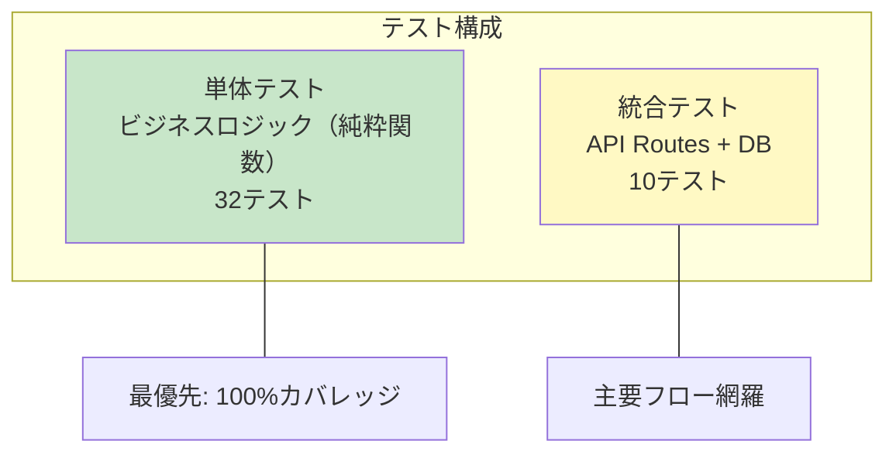
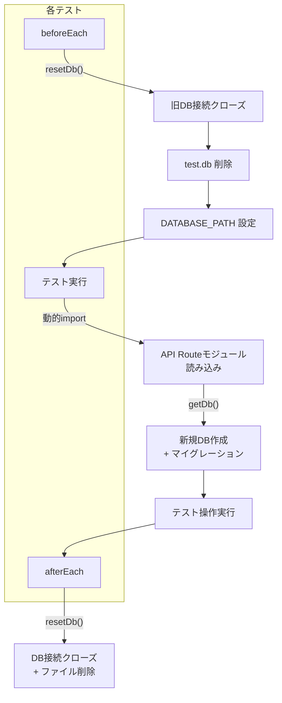

# テスト設計

## 1. テスト戦略

### 1.1 テストピラミッド



### 1.2 テスト対象の選定基準

| 対象 | テスト | 理由 |
|---|---|---|
| lib/logic/* | ○ 単体テスト | 純粋関数、テスト容易、バグの影響大 |
| app/api/* | ○ 統合テスト | バリデーション・制約ロジックの検証 |
| hooks/* | △ 省略 | 個人利用のため、API経由で間接検証 |
| components/* | △ 省略 | 個人利用のため、手動確認で十分 |
| lib/schema.ts | △ 省略 | API統合テストで間接検証 |

## 2. テストフレームワーク

- **Vitest 4.x**
- 環境: Node（`environment: 'node'`）
- グローバルAPI有効（`globals: true`）
- パスエイリアス: `@/` → プロジェクトルート

```typescript
// vitest.config.ts
export default defineConfig({
  test: { globals: true, environment: 'node' },
  resolve: { alias: { '@': path.resolve(__dirname, '.') } },
});
```

## 3. 単体テスト

### 3.1 task-logic.test.ts（25テスト）

#### computeParentStatus

| # | テストケース | 入力 | 期待値 |
|---|---|---|---|
| 1 | サブタスクなしでエラー | `[]` | throw |
| 2 | 全done | `[done, done]` | done |
| 3 | done + canceled | `[done, canceled]` | done |
| 4 | doing + done | `[doing, done]` | doing |
| 5 | yet + done | `[yet, done]` | doing |
| 6 | pending + done | `[pending, done]` | doing |
| 7 | 全canceled | `[canceled, canceled]` | done |

#### shouldBePending

| # | テストケース | 入力 | 期待値 |
|---|---|---|---|
| 8 | ブロッカーなし | `[]` | false |
| 9 | 全done | `[done, done]` | false |
| 10 | done + canceled | `[done, canceled]` | false |
| 11 | yet + done | `[yet, done]` | true |
| 12 | doing | `[doing]` | true |
| 13 | pending | `[pending]` | true |

#### validateSubTaskDependencies

| # | テストケース | 期待値 |
|---|---|---|
| 14 | blocked_byなし | valid: true |
| 15 | 兄弟のみ参照 | valid: true |
| 16 | 非兄弟を参照 | valid: false |
| 17 | 親なし（トップレベル） | valid: false |

#### canBeSubTask

| # | テストケース | 期待値 |
|---|---|---|
| 18 | 親がトップレベル | true |
| 19 | 親がサブタスク | false |

#### canManuallyChangeStatus

| # | テストケース | 期待値 |
|---|---|---|
| 20 | サブタスクなし | true |
| 21 | サブタスクあり | false |

#### computeEffectiveStatus

| # | テストケース | 期待値 |
|---|---|---|
| 22 | ブロッカーなし | currentStatus |
| 23 | 未解消ブロッカーあり | pending |
| 24 | pending → ブロッカー全解消 | yet |
| 25 | doing → ブロッカー全解消 | doing |

### 3.2 project-logic.test.ts（7テスト）

#### suggestProjectStatus

| # | テストケース | 入力 | 期待値 |
|---|---|---|---|
| 1 | タスクなし | `[]` | yet |
| 2 | 全done | `[done, done]` | finished |
| 3 | done + canceled | `[done, canceled]` | finished |
| 4 | doing + yet | `[doing, yet]` | processing |
| 5 | pending + yet | `[pending, yet]` | processing |
| 6 | 全yet | `[yet, yet]` | yet |
| 7 | yet + canceled | `[yet, canceled]` | yet |

## 4. 統合テスト

### 4.1 テストインフラ



### 4.2 api.test.ts（10テスト）

#### Projects API

| # | テストケース | 検証内容 |
|---|---|---|
| 1 | プロジェクトの作成と一覧取得 | POST 201、GET でリスト返却 |
| 2 | プロジェクトの更新 | PATCH でtitle/status変更 |
| 3 | プロジェクトの削除 | DELETE 後に一覧が空 |

#### Tasks API

| # | テストケース | 検証内容 |
|---|---|---|
| 4 | タスクの作成と一覧取得 | POST 201、priority設定確認 |
| 5 | サブタスク作成と親ステータス自動計算 | サブタスク追加→親doing、サブタスクdone→親done |
| 6 | サブサブタスクの拒否 | POST 400 エラー |
| 7 | サブタスク存在時のステータス手動変更拒否 | PATCH 400 エラー |
| 8 | blocked_by依存関係 | ブロッカーあり→status=pending |
| 9 | サブタスクの兄弟制約 | 兄弟→201、非兄弟→400 |
| 10 | サブタスクのproject_id継承 | 親のproject_idが自動設定 |

### 4.3 テスト実行

```bash
# 全テスト実行
npx vitest run

# 特定ファイル
npx vitest run lib/logic/__tests__/task-logic.test.ts

# 特定テスト
npx vitest run -t "should compute parent status"

# ウォッチモード
npx vitest
```

## 5. テスト結果サマリ

```
 ✓ lib/logic/__tests__/project-logic.test.ts (7 tests)
 ✓ lib/logic/__tests__/task-logic.test.ts (25 tests)
 ✓ app/api/__tests__/api.test.ts (10 tests)

 Test Files  3 passed (3)
      Tests  42 passed (42)
```
