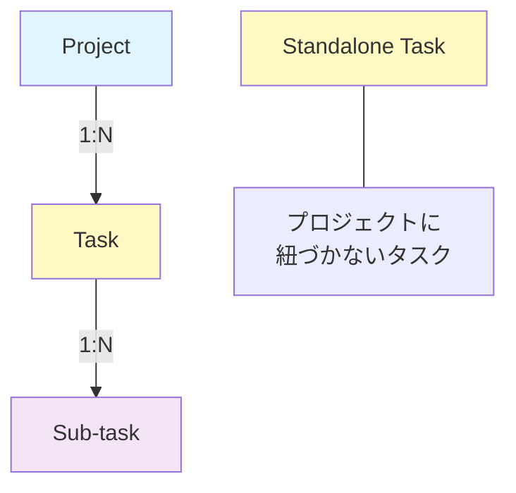
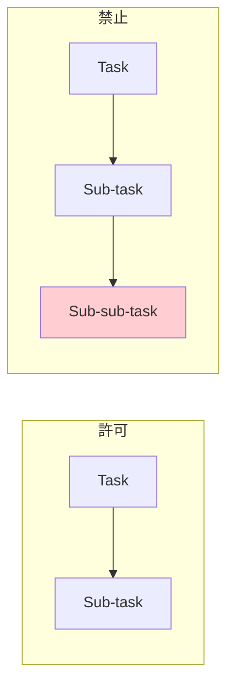
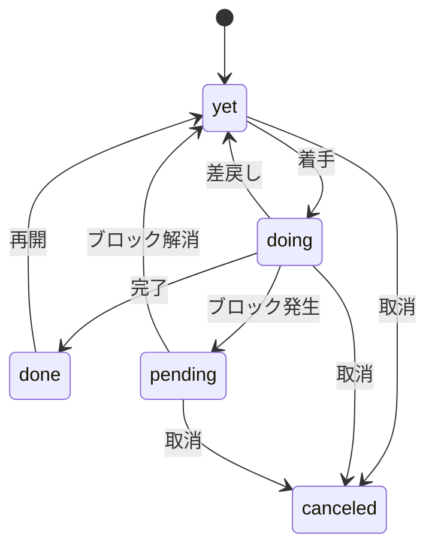
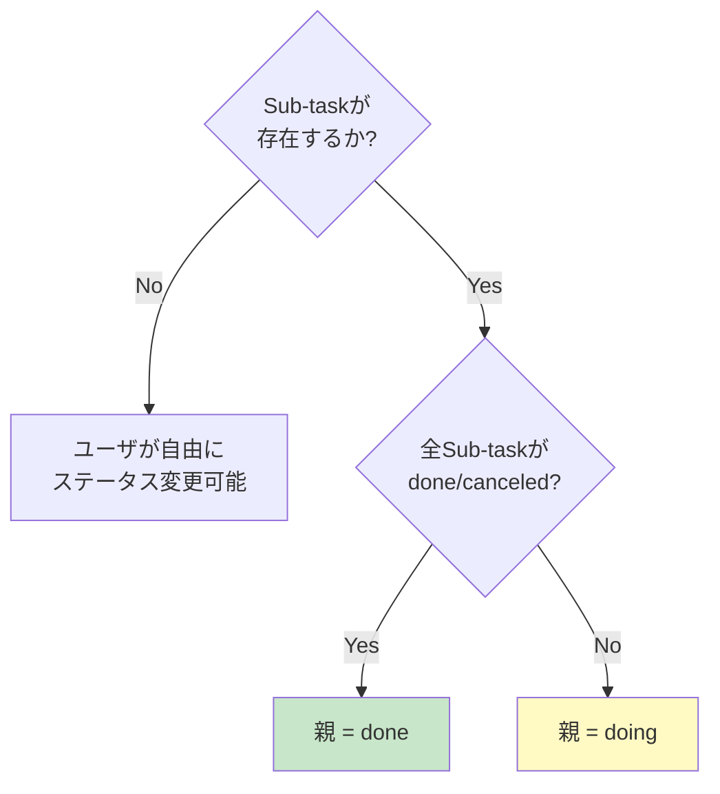

# 機能要件

## 1. データモデル

### 1.1 階層構造

本アプリケーションは3階層のデータ構造を持つ。

- **Project**: タスクをグループ化する上位概念
- **Task**: 実行可能な行動単位。プロジェクトに紐づくものと紐づかないもの（Standalone）がある
- **Sub-task**: タスクを細分化したもの。データ構造はTaskと同一だが、特定のタスクに紐づく

### 1.2 Project

| プロパティ | 型 | 必須 | 説明 |
|---|---|---|---|
| id | string | 自動 | 一意識別子（16文字hex） |
| title | string | ○ | プロジェクト名 |
| status | enum | ○ | yet / processing / finished |
| condition | string | - | 完了条件 |
| created_at | datetime | 自動 | 作成日時 |
| updated_at | datetime | 自動 | 更新日時 |

### 1.3 Task / Sub-task

TaskとSub-taskは同一のデータ構造を持つ。`parent_task_id` の有無でSub-taskかどうかが決まる。

| プロパティ | 型 | 必須 | 説明 |
|---|---|---|---|
| id | string | 自動 | 一意識別子（16文字hex） |
| title | string | ○ | タスク名 |
| condition | string | - | 完了条件 |
| due_date | date | - | 期日 |
| priority | enum | ○ | must / should / want |
| status | enum | ○ | canceled / yet / doing / pending / done |
| project_id | string? | - | 所属プロジェクトID（nullable） |
| parent_task_id | string? | - | 親タスクID（Sub-taskの場合） |
| blocked_by | string[] | - | このタスクをブロックするタスクID群 |
| created_at | datetime | 自動 | 作成日時 |
| updated_at | datetime | 自動 | 更新日時 |

### 1.4 階層の制約

- Sub-taskは**1階層のみ**。Sub-taskがさらにSub-taskを持つことは禁止
- Sub-taskは**親タスクと同じプロジェクト**に属する（異なるproject_idを持てない）
- タスクはプロジェクトに紐づかなくても存在できる（Standalone Task）

## 2. ステータス制御

### 2.1 タスクステータスの状態遷移

### 2.2 ブロック関係（blocked_by）

- タスクは1つ以上の**先行タスク**を `blocked_by` に登録できる
- `blocked_by` に未完了のタスクが存在する場合、そのタスクのステータスは **pending** となる
- 全ての先行タスクが done または canceled になると、pending は **yet** に自動復帰する

#### Sub-taskのblocked_by制約

- Sub-taskの `blocked_by` には**同じ親タスクに属する兄弟Sub-task**のみを指定できる
- 親の異なるSub-taskや、トップレベルタスクは指定できない

### 2.3 Sub-taskによる親タスクのステータス自動計算

Sub-taskが1つ以上存在する場合、親タスクのステータスは**自動計算**され、手動での変更は不可となる。

| 条件 | 親タスクのステータス |
|---|---|
| Sub-taskが1つでも doing | doing |
| Sub-taskが1つでも yet | doing |
| Sub-taskが1つでも pending | doing |
| Sub-taskにblocked_byあり | doing |
| 全Sub-taskが done または canceled | done |
| Sub-taskが存在しない | ユーザが自由に設定 |

### 2.4 プロジェクトステータス

プロジェクトのステータスはユーザーが手動で管理する。参考値としてタスクの状態からの推奨値を導出する機能がある。

| タスクの状態 | 推奨ステータス |
|---|---|
| タスクなし | yet |
| 全タスクが done/canceled | finished |
| doing/pending のタスクが1つ以上 | processing |
| 上記以外 | yet |

## 3. ビュー仕様

### 3.1 共通仕様

- 全ビューにおいて、デフォルトでは **yet / doing / pending** の3ステータスのみ表示する
- ユーザーはフィルターコントロール（トグルボタン群）でステータスの表示/非表示をシームレスに切り替えられる
- 全ビューで parent_task_id が null のタスク（トップレベルタスク）のみを一覧表示する
- Sub-taskは親タスクの展開により表示する

### 3.2 Priority View（優先度別ビュー）

- パス: `/priority`（デフォルトビュー）
- Must / Should / Want の3グループにタスクを分類してテーブル表示
- 各グループにタスク件数を表示

### 3.3 All Tasks View（全タスクリストビュー）

- パス: `/tasks`
- 全タスクを単一のテーブルで表示
- 優先度・プロジェクト・期日の列を含む

### 3.4 Projects View（プロジェクト別ビュー）

- パス: `/projects`
- プロジェクトごとにセクションを分け、各セクション内にタスクテーブルを表示
- プロジェクト名・ステータス・進捗（完了数/全数）を表示
- プロジェクトに紐づかないタスクは「No Project」セクションに表示

## 4. CRUD操作

### 4.1 Project

| 操作 | 説明 |
|---|---|
| 作成 | タイトル（必須）・完了条件・ステータスを入力 |
| 編集 | 全フィールドを変更可能 |
| 削除 | プロジェクト削除時、紐づくタスクはStandaloneになる（削除されない） |

### 4.2 Task / Sub-task

| 操作 | 説明 |
|---|---|
| 作成 | タイトル（必須）・完了条件・期日・優先度・ステータス・プロジェクト・blocked_by を入力 |
| 編集 | 全フィールドを変更可能（制約あり） |
| ステータス変更 | テーブル上のステータスバッジクリックで yet→doing→done をサイクル |
| Sub-task追加 | 親タスクのメニューから追加。親のproject_idを自動継承 |
| 削除 | タスク削除時、Sub-taskもカスケード削除される |
