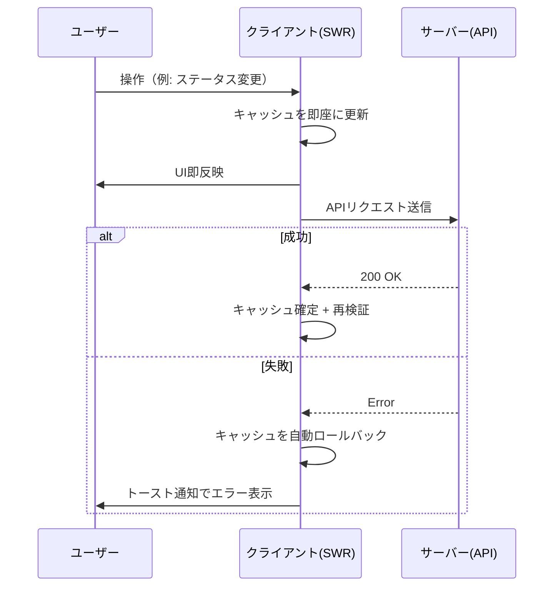

# 非機能要件

## 1. 認証

- **方式**: Proxy経由のBasic認証（HTTP標準）
- **実装**: Next.js Middleware でリクエストごとに `Authorization` ヘッダーを検証
- **認証情報**: 環境変数 `BASIC_AUTH_USER` / `BASIC_AUTH_PASS` で設定（デフォルト: admin/password）
- **適用範囲**: 静的アセット（`_next/static`, `_next/image`, `favicon.ico`）を除く全ルート
- **セッション管理**: 不要（Basic認証はブラウザがヘッダーを自動送信）

## 2. レスポンシブ対応

- スマートフォン（モバイル）とPC（デスクトップ）の両方で動作すること
- テーブル表示において、モバイルではProject列・Due列を非表示とし、横スクロールを防止する
- タッチデバイスでの操作を考慮したタップ領域の確保

## 3. UI/UX方針

### 3.1 UIフレームワーク

- **shadcn-ui**（base-ui版）を採用する
- Tailwind CSS v4 によるスタイリング
- Lucide React によるアイコン

### 3.2 ダークモード

- **実装しない**（ライトモードのみ）

### 3.3 楽観的更新（Optimistic Update）

非同期処理におけるUX品質を確保するため、楽観的更新パターンを採用する。

- ユーザー操作を**即座にUIに反映**し、バックグラウンドでサーバーと同期する
- サーバー同期に失敗した場合は**自動ロールバック**し、**トースト通知**でエラーを表示する
- クライアント側でIDを事前生成することで、作成操作でも楽観的更新を実現する

### 3.4 トースト通知

- ライブラリ: sonner
- 表示位置: 画面右下
- 用途: エラー時のフィードバック（楽観的更新の失敗通知）

## 4. データ永続化

- **データベース**: SQLite（better-sqlite3）
- **同期方式**: 同期I/O（better-sqlite3の特性。Node.jsワーカースレッドで実行されるため問題なし）
- **保存場所**: `data/todo.db`（環境変数 `DATABASE_PATH` で変更可能）
- **WALモード**: 有効（同時読み取りパフォーマンス向上）
- **外部キー制約**: 有効

## 5. テスト方針

- **テストフレームワーク**: Vitest
- **対象範囲**:
  - ビジネスロジック（純粋関数）: 100%カバレッジを目標
  - API統合テスト: 主要なCRUD操作と制約バリデーションを網羅
  - フロントエンドテスト: 個人利用のため省略
- **テスト実行**: `npx vitest run`

## 6. 開発環境

| 項目 | 採用技術 |
|---|---|
| ランタイム | Node.js |
| フレームワーク | Next.js 16（App Router） |
| 言語 | TypeScript（strict mode） |
| パッケージマネージャ | pnpm |
| リンター | ESLint（Next.js推奨設定） |
| CSS | Tailwind CSS v4 |
| フォント | Geist Sans / Geist Mono |
